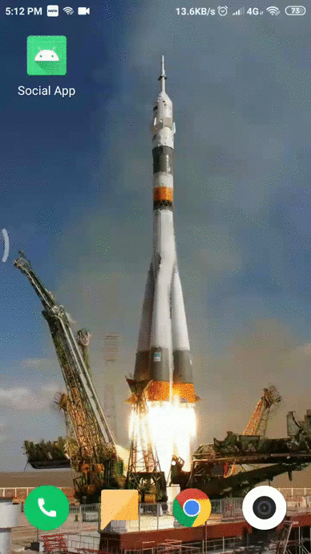

# Mini_Social_App

A small social media app which allows users to post and like the post/thoughts shared by the people around the world.

Concepts used in building this applications are

-> User authentication using google sign in option.

-> Coroutines

-> DAO (Data access object)

-> Firestore/Firebase implementation

-> Use of FirestoreRecyclerview

